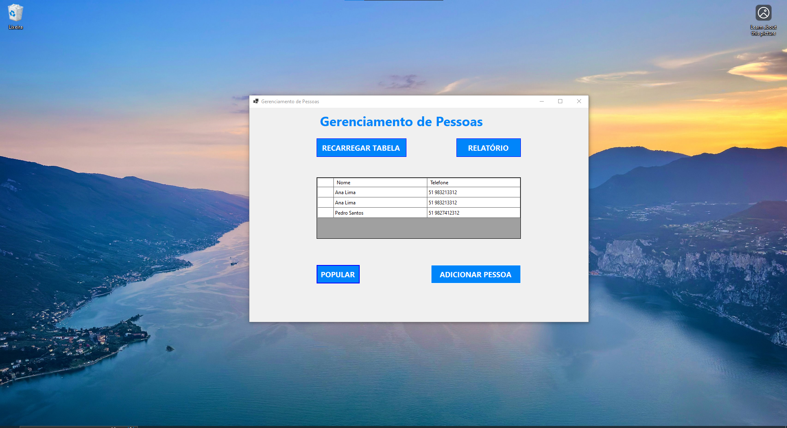

# TesteConhecimento

Projeto em **C# / .NET** voltado para estudos e experimentação, utilizando **ASP.NET**, **Entity Framework Core** e dependências do **ReportViewerCore (ReportViewerCore.WinForms)**.

---

## 🛠️ Ferramentas Necessárias

Para rodar e desenvolver este projeto, é necessário ter as seguintes ferramentas instaladas no ambiente:

* **Git** – utilizado para clonar o repositório e versionar o código.
* **Docker** – usado para subir serviços auxiliares (ex.: banco de dados) de forma padronizada.
* **.NET SDK** – necessário para compilar e executar o projeto (`net10.0-windows`).
* **dotnet-ef** – ferramenta do Entity Framework Core para criação e execução de migrations.

Instalação do `dotnet-ef` (caso não esteja disponível):

```bash
dotnet tool install --global dotnet-ef
```

Certifique-se de que todas as ferramentas acima estejam acessíveis pelo `PATH` do sistema antes de executar o projeto.

---

## 📚 Dependências

O projeto utiliza as seguintes dependências principais:

* **Microsoft.EntityFrameworkCore** — ORM para acesso a dados
* **Pomelo.EntityFrameworkCore.MySql** — Provider MySQL para EF Core
* **MySqlConnector** — Conector MySQL gerenciado
* **Microsoft.ReportViewer.WinForms** — Visualização de relatórios (WinForms)

Essas dependências são restauradas automaticamente via **NuGet** durante o build.

---


## 📦 Estrutura do projeto

* `Controllers/` — Controllers da aplicação
* `Models/` — Modelos de domínio
* `Views/` — Views (MVC)
* `Migrations/` — Migrations do Entity Framework
* `Infrastructure/` — Camada de infraestrutura
* `Program.cs` — Ponto de entrada da aplicação
* `docker-compose.yml` — Ambiente Docker para serviços auxiliares

---

## ▶️ Executando o projeto

No Windows:

```bash
git clone https://github.com/luiizfelipe/TesteConhecimento.git
cd TesteConhecimento
docker compose up -d
dotnet ef database update
dotnet build
dotnet run
```

---

## Demo


▶️ [Ver vídeo completo](./Sample/sample.mp4)

---

## 👤 Autor

Eu

---

> Projeto voltado para aprendizado, testes de conceito e evolução contínua.
